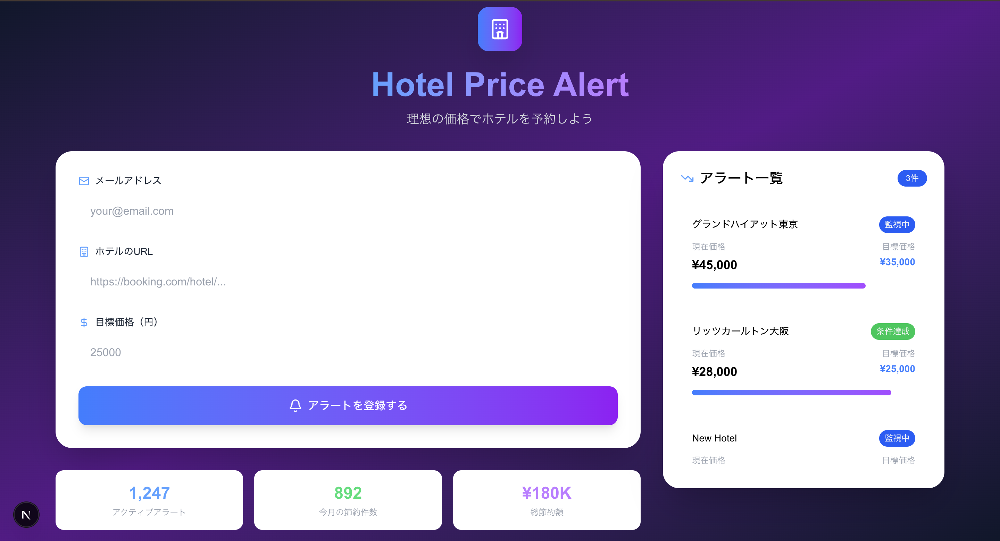

# Hotel Price Alert Frontend

ホテル価格監視システムのフロントエンドアプリケーションです。美しいUIでホテルの価格アラートを簡単に設定・管理できます。

## 🖼️ スクリーンショット



*美しいグラデーション背景とモダンなUIで、直感的な価格アラート設定が可能*

## 🚀 機能

- **直感的なUI**: モダンで美しいデザイン
- **リアルタイムフォーム**: 入力検証とリアルタイムフィードバック
- **アラート管理**: アクティブなアラートの一覧表示と管理
- **レスポンシブデザイン**: デスクトップ・タブレット・モバイル対応
- **アニメーション**: スムーズなトランジションとアニメーション効果
- **統計表示**: アクティブアラート数、節約件数、総節約額の表示

## 🛠️ 技術スタック

- **フレームワーク**: Next.js 15.4.5 (App Router)
- **言語**: TypeScript 5
- **スタイリング**: Tailwind CSS 4
- **アイコン**: Lucide React
- **状態管理**: React Hooks (useState, useEffect)
- **開発環境**: ESLint, Turbopack

## 📋 前提条件

- Node.js 18.0以上
- npm または yarn

## 🔧 セットアップ

### 1. リポジトリのクローン
```bash
git clone <repository-url>
cd hotel-price-alert/frontend
```

### 2. 依存関係のインストール
```bash
npm install
# または
yarn install
```

### 3. 開発サーバーの起動
```bash
npm run dev
# または
yarn dev
```

アプリケーションは `http://localhost:3000` で起動します。

### 4. ビルド（本番用）
```bash
npm run build
npm start
```

## 🎨 UI/UX の特徴

### デザインシステム
- **カラーパレット**: ダークテーマ（スレート900〜パープル900のグラデーション）
- **タイポグラフィ**: モダンなフォントスタック
- **コンポーネント**: ガラスモーフィズム効果とバックドロップフィルター
- **アニメーション**: CSSトランジションとキーフレームアニメーション

### 主要コンポーネント

#### 1. ヘッダーセクション
- プロジェクトロゴとアイコン
- グラデーションテキストのタイトル
- 説明文

#### 2. メインフォーム
- **メールアドレス入力**: バリデーション付き
- **ホテルURL入力**: URL形式チェック
- **目標価格入力**: 数値バリデーション
- **送信ボタン**: ローディング状態とアニメーション

#### 3. アラート一覧サイドバー
- アクティブなアラートの表示
- 価格比較プログレスバー
- ステータス表示（監視中/条件達成）

#### 4. 統計情報
- アクティブアラート数
- 今月の節約件数
- 総節約額

## 📱 レスポンシブデザイン

### ブレークポイント
- **モバイル**: < 768px
- **タブレット**: 768px - 1024px
- **デスクトップ**: > 1024px

### レイアウト
- **モバイル**: シングルカラム、スタックレイアウト
- **タブレット**: 2カラムグリッド
- **デスクトップ**: 3カラムグリッド（フォーム + サイドバー）

## 🔌 API 連携

### エンドポイント
```typescript
// アラート作成
POST /api/alerts
{
  email: string;
  hotelUrl: string;
  targetPrice: number;
}
```

### エラーハンドリング
- ネットワークエラーの表示
- バリデーションエラーの表示
- 成功/失敗メッセージの表示

## 🎭 アニメーション

### ページロードアニメーション
- フェードイン効果
- スライドアップアニメーション
- 遅延付きアニメーション

### インタラクションアニメーション
- ホバーエフェクト
- フォーカスエフェクト
- ボタンクリックアニメーション

## 📁 プロジェクト構造

```
frontend/
├── src/
│   └── app/
│       ├── layout.tsx          # ルートレイアウト
│       ├── page.tsx            # メインページ
│       ├── globals.css         # グローバルスタイル
│       └── favicon.ico         # ファビコン
├── public/                     # 静的ファイル
├── package.json                # 依存関係
├── tsconfig.json              # TypeScript設定
├── tailwind.config.js         # Tailwind設定
└── next.config.ts             # Next.js設定
```

## 🚀 デプロイ

### Vercel（推奨）
```bash
npm run build
vercel --prod
```

### その他のプラットフォーム
- Netlify
- AWS Amplify
- Google Cloud Platform

## 🧪 開発

### 開発コマンド
```bash
# 開発サーバー起動
npm run dev

# ビルド
npm run build

# 本番サーバー起動
npm start

# リント
npm run lint
```

### コード品質
- ESLint設定済み
- TypeScript型チェック
- Prettier設定（推奨）

## 🎯 今後の改善予定

- [ ] ダーク/ライトテーマ切り替え
- [ ] 多言語対応（英語/日本語）
- [ ] PWA対応
- [ ] オフライン機能
- [ ] プッシュ通知
- [ ] アラート履歴機能

## 🤝 コントリビューション

1. このリポジトリをフォーク
2. 機能ブランチを作成 (`git checkout -b feature/amazing-feature`)
3. 変更をコミット (`git commit -m 'Add amazing feature'`)
4. ブランチにプッシュ (`git push origin feature/amazing-feature`)
5. プルリクエストを作成

## 📄 ライセンス

このプロジェクトはMITライセンスの下で公開されています。

## 📞 サポート

問題や質問がある場合は、GitHubのIssuesページでお知らせください。

---

**Hotel Price Alert Frontend** - 理想の価格でホテルを予約しよう 🏨✨
